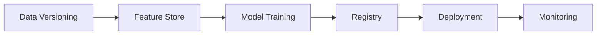

# 🚀 ML Playbook
A well-structured public ML/DL repository.

[](LICENSE)
[](https://github.com/yourusername/ml-playbook/actions)
[](https://codecov.io/gh/yourusername/ml-playbook)

**A Production-Ready Machine Learning Toolkit**  
*From Fundamentals to Real-World Implementations*

## 🗂️ Repository Structure

```
ml-playbook/
├── 📂 core_algorithms/          # Classic ML Implementations
│   ├── supervised/
│   ├── unsupervised/
│   └── reinforcement/
│
├── 📂 deep_learning/           # Neural Network Architectures
│   ├── computer_vision/
│   ├── nlp/
│   └── generative/
│
├── 📂 real_world/              # End-to-End Solutions
│   ├── healthcare/
│   ├── finance/
│   ├── manufacturing/
│   └── templates/             # Project Scaffolding
│
├── 📂 mlops/                   # Productionization Tools
│   ├── model_serving/
│   ├── monitoring/
│   └── pipelines/
│
├── 📚 docs/                    # Technical Documentation
├── ⚙️ .github/                 # CI/CD Workflows
└── 🧪 tests/                   # Unit & Integration Tests
```

### Getting Started:
we recommend using [uv](https://github.com/astral-sh/uv). Then, run the following commands:
```bash
# Clone with git
git clone https://github.com/abhi1497/ml-playbook
git pull
```

### MLOps Workflow


## 🤝 Contribution Guidelines

### Ideal Contributions:
- 🆕 Implement new algorithms with tests
- 🐛 Fix edge cases in existing implementations
- 📖 Improve documentation/examples
- 🌐 Add multilingual dataset support


## 🚧 Roadmap

- [ ] Add LLM fine-tuning templates
- [ ] Implement real-time anomaly detection
- [ ] Create AWS SageMaker examples
- [ ] Develop Gradio/FastAPI demo apps

---

**Why Contribute?**  
- Get featured in our contributor hall of fame
- Receive expert code reviews from ML engineers
- Build portfolio-worthy production ML experience